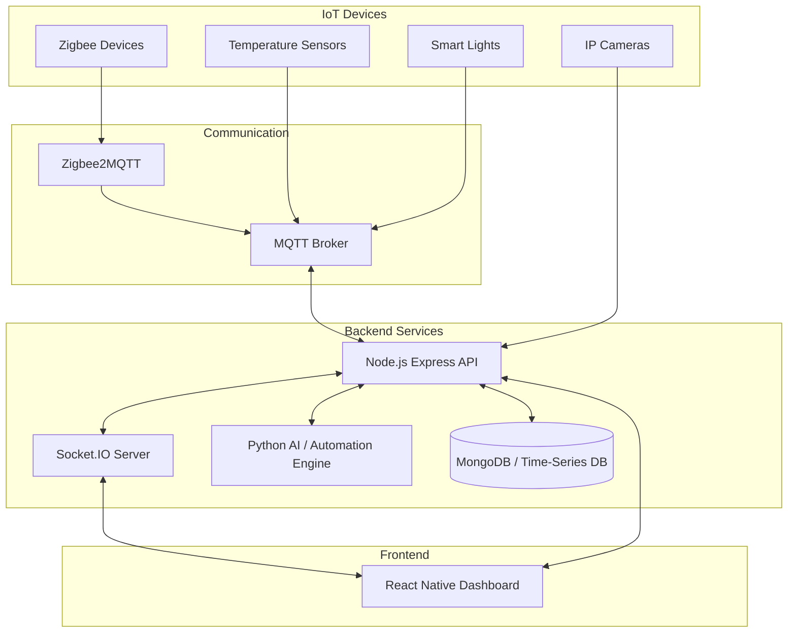

# Architecture Diagram

```mermaid
graph TD
    %% IoT Layer
    subgraph IoT Devices
        S1[Temperature Sensors]
        L1[Smart Lights]
        C1[IP Cameras]
        Z1[Zigbee Devices]
    end

    %% Communication Layer
    subgraph Communication
        M1[MQTT Broker]
        Z2M[Zigbee2MQTT]
    end

    %% Processing Layer
    subgraph Backend Services
        API[Node.js Express API]
        WS[Socket.IO Server]
        AI[Python AI / Automation Engine]
        DB[(MongoDB / Time-Series DB)]
    end

    %% Application Layer
    subgraph Frontend
        App[React Native Dashboard]
    end

    %% Connections
    Z1 --> Z2M
    Z2M --> M1
    S1 --> M1
    L1 --> M1
    
    M1 <--> API
    C1 --> API
    
    API <--> DB
    API <--> AI
    API <--> WS
    
    WS <--> App
    API <--> App
```
